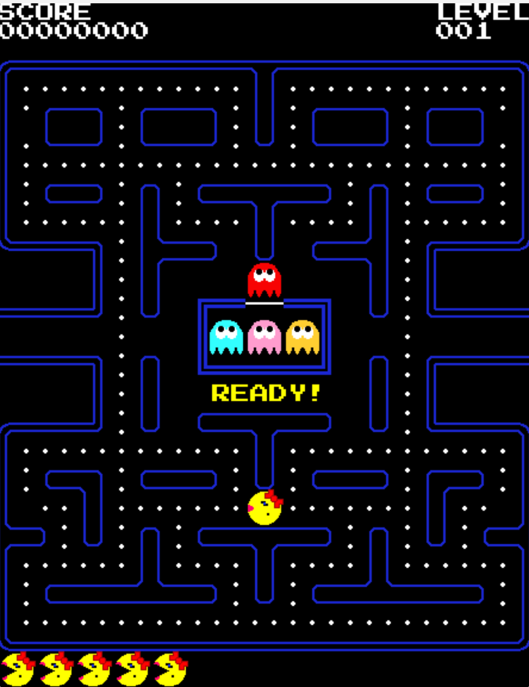

# Py-Man

AI research with a Pac-Man foundation

The goal is to implement all the AI methods described in the book [Artificial Intelligence and Games](https://www.amazon.com/Artificial-Intelligence-Games-Georgios-Yannakakis/dp/3319635182?nodl=1&dplnkId=8572224e-4222-4d14-b38d-547b92d763c9)

Game assets are from [Pacman](https://pacmancode.com/). 

